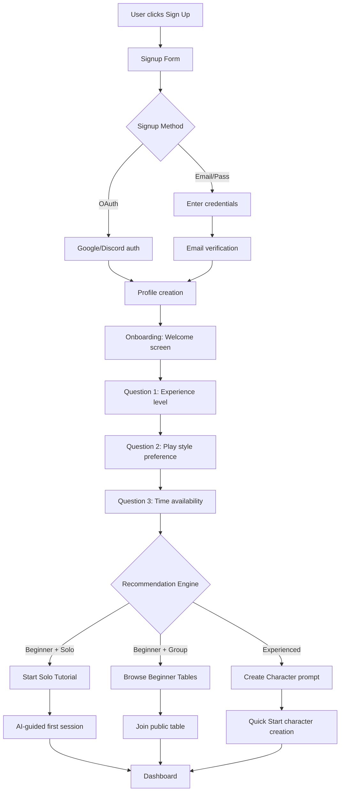
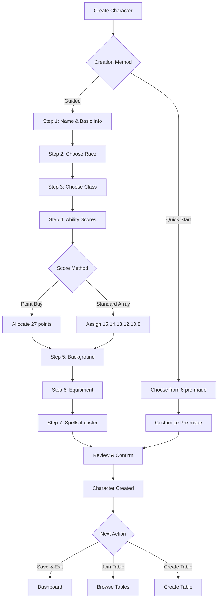
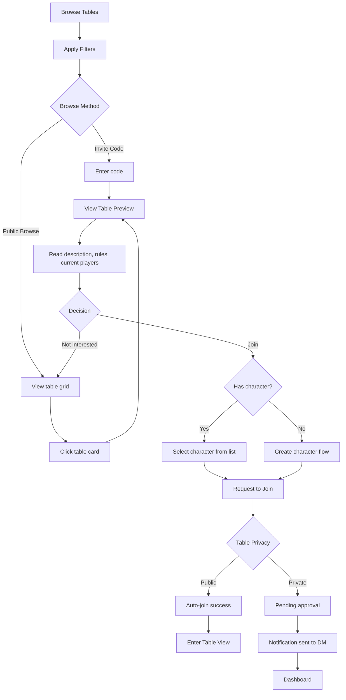
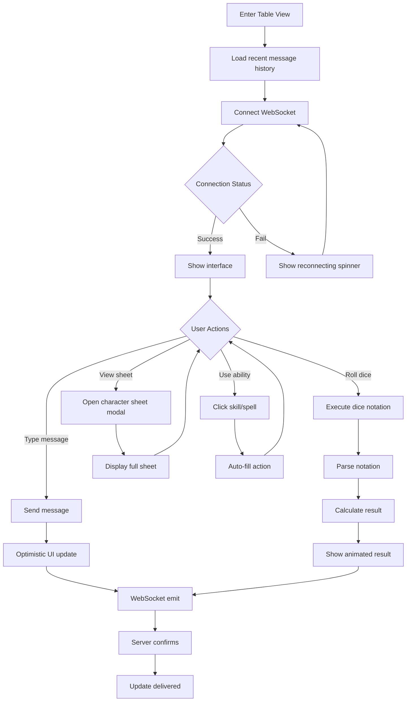
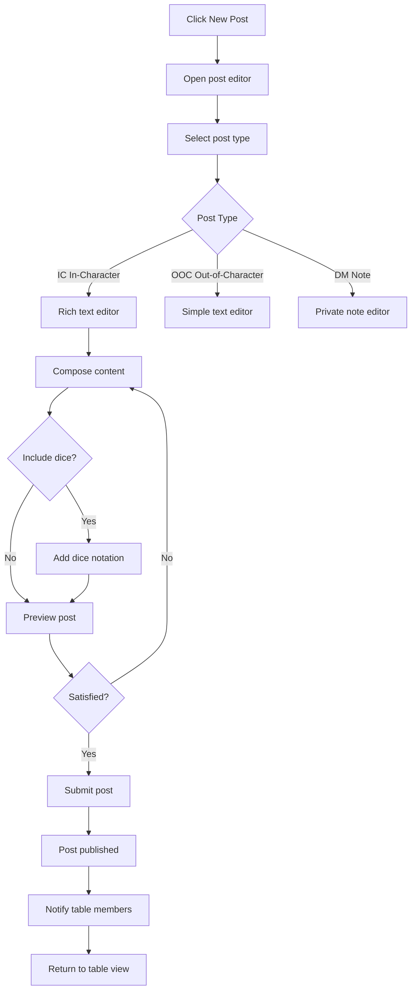

# IA-RPG UI/UX Specification

**Version:** 1.4 (Production-Ready)
**Date:** September 30, 2025
**Status:** ✅ Ready for Development Handoff
**Owner:** Sally (UX Expert)
**Related Documents:** [PRD v1.1](./prd.md)

---

## TABLE OF CONTENTS

1. [Introduction](#1-introduction)
2. [Overall UX Goals & Principles](#2-overall-ux-goals--principles)
3. [Information Architecture](#3-information-architecture)
4. [User Flows](#4-user-flows)
5. [Wireframes & Screen Layouts](#5-wireframes--screen-layouts)
6. [Component Library & Design System](#6-component-library--design-system)
7. [Branding & Style Guide](#7-branding--style-guide)
8. [Accessibility Requirements](#8-accessibility-requirements)
9. [Responsiveness Strategy](#9-responsiveness-strategy)
10. [Animation & Micro-interactions](#10-animation--micro-interactions)
11. [Performance Considerations](#11-performance-considerations)
12. [Next Steps](#12-next-steps)
13. [Change Log](#13-change-log)

---

## 1. INTRODUCTION

This document defines the user experience goals, information architecture, user flows, and visual design specifications for IA-RPG's user interface. It serves as the foundation for visual design and frontend development, ensuring a cohesive and user-centered experience.

IA-RPG is a text-based RPG platform that enables players to experience tabletop gaming in three flexible modes: synchronous (live chat), asynchronous (play-by-post), and solo (AI as DM). The interface prioritizes **content-first design**, putting narrative and gameplay at the center while keeping UI minimal and functional.

### 1.1 Document Purpose

This specification provides:
- Detailed user flows for critical journeys
- Comprehensive interaction patterns and states
- Responsive design strategy across devices
- Accessibility guidelines and requirements
- Animation and motion design principles
- Performance targets that impact UX decisions

### 1.2 Design Philosophy Summary

**Content First, UI Second:** The interface should be invisible, allowing players to focus on the story. We follow a monochromatic design with strategic use of neon green (<10% visual weight) for key interactions.

**Reference Aesthetics:**
- **Substack:** Clean reading experience, typography-focused
- **Netflix:** Browse UI, card-based discovery
- **Linear:** Fast, keyboard-friendly workflows
- **Notion:** Calm, organized, functional

---

## 2. OVERALL UX GOALS & PRINCIPLES

### 2.1 Target User Personas

#### Primary Personas:

**1. The Busy Parent (35-45 years)**
- **Profile:** Former RPG player who stopped due to time constraints
- **Pain Points:** Can't commit to 4-hour blocks, unpredictable schedule
- **Needs:** Flexible play modes, 30-60 minute sessions
- **UX Priorities:** Quick session resume, clear progress indicators, minimal learning curve

**2. The Solo Curious (18-30 years)**
- **Profile:** Interested in RPG but never played, intimidated by complexity
- **Pain Points:** Social anxiety, fear of slowing group down, no gaming friends
- **Needs:** Solo learning mode, guided tutorials, low-pressure environment
- **UX Priorities:** Onboarding that builds confidence, AI assistance, gradual complexity

**3. The Veteran Without Group (25-40 years)**
- **Profile:** Experienced player who lost their gaming group
- **Pain Points:** Scheduling conflicts, timezone mismatches
- **Needs:** Easy group discovery, portable characters
- **UX Priorities:** Efficient table browsing, multi-table management, quick character switching

**4. The IRPG Nostalgic (30-45 years)**
- **Profile:** Played text-based RPG forums in 2000s-2010s
- **Pain Points:** Modern platforms focus on voice/video, lack text-first options
- **Needs:** Thoughtful, asynchronous roleplay
- **UX Priorities:** Rich text editing, threading, post history

### 2.2 Usability Goals

1. **Ease of Learning:** New users complete first session within 10 minutes of signup
2. **Efficiency of Use:** Experienced users can execute common actions in <3 clicks
3. **Error Prevention:** Clear validation and confirmation for destructive actions (delete character, leave table)
4. **Memorability:** Infrequent users can return after weeks without relearning
5. **Satisfaction:** Clean, focused interface that respects user intelligence

### 2.3 Design Principles

1. **Clarity over Cleverness**
   - Use familiar patterns (standard nav, buttons, forms)
   - Avoid jargon in UI labels (except D&D terms players expect)
   - Every action should have clear, immediate feedback

2. **Progressive Disclosure**
   - Show only what's needed at each step
   - Advanced features hidden until needed (keyboard shortcuts, API)
   - Character sheets collapse sections not currently relevant

3. **Consistent Patterns**
   - Same interaction patterns across all screens
   - Predictable navigation structure
   - Reusable components with consistent behavior

4. **Immediate Feedback**
   - Optimistic UI updates (message sends immediately)
   - Visual feedback for all interactions (hover, active, loading states)
   - Typing indicators, real-time updates

5. **Accessible by Default**
   - Keyboard navigation for all actions
   - Screen reader support with ARIA labels
   - High contrast text (4.5:1+ ratio)
   - Touch targets ≥44px

6. **Whitespace as Feature**
   - Generous padding prevents visual clutter
   - Reading-optimized layouts (680px max-width for posts)
   - Clear visual hierarchy through spacing

---

## 3. INFORMATION ARCHITECTURE

### 3.1 Site Map / Screen Inventory

```mermaid
graph TD
    A[IA-RPG Root] --> B[Public]
    A --> C[Authenticated]

    B --> B1[Landing Page /]
    B --> B2[About /about]
    B --> B3[Pricing /pricing]
    B --> B4[Login /login]
    B --> B5[Signup /signup]
    B --> B6[Join /join/:code]

    C --> C1[Dashboard /dashboard]
    C --> C2[Tables Section]
    C --> C3[Characters Section]
    C --> C4[Profile Section]
    C --> C5[Settings Section]
    C --> C6[Help Section]

    C2 --> C2A[Browse /tables]
    C2 --> C2B[Create /tables/new]
    C2 --> C2C[Table View /tables/:id]
    C2 --> C2D[Table Settings /tables/:id/settings]

    C3 --> C3A[My Characters /characters]
    C3 --> C3B[Create /characters/new]
    C3 --> C3C[Sheet /characters/:id]
    C3 --> C3D[Edit /characters/:id/edit]

    C4 --> C4A[My Profile /profile]
    C4 --> C4B[Edit Profile /profile/edit]
    C4 --> C4C[Public Profile /u/:username]

    C5 --> C5A[Account /settings/account]
    C5 --> C5B[Notifications /settings/notifications]
    C5 --> C5C[Billing /settings/billing]
    C5 --> C5D[Privacy /settings/privacy]

    C6 --> C6A[Help Center /help]
    C6 --> C6B[FAQ /faq]
    C6 --> C6C[Contact /contact]
```



### 3.2 Navigation Structure

**Primary Navigation (Top Bar):**
- Persistent across all authenticated screens
- Structure: `[Logo] Dashboard | Tables | Characters | [Search] [Notifications] [Avatar Menu]`
- Hamburger menu on mobile (<768px)

**Secondary Navigation:**
- Contextual tabs within sections
- Example (Tables): Browse | My Tables | Create
- Example (Characters): All | Favorites | Archived

**Breadcrumb Strategy:**
- Used in deep navigation paths
- Format: `Dashboard > Tables > "The Lost Mines" > Settings`
- Clickable ancestors for easy navigation back

**Mobile Navigation:**
- Bottom tab bar on mobile (<640px)
- Icons: Home, Tables, Characters, Profile
- "+

" FAB (Floating Action Button) for quick create actions

---

## 4. USER FLOWS

### 4.1 Flow: First-Time User Onboarding

**User Goal:** Complete signup and start first game session

**Entry Points:** Landing page CTA, direct /signup link

**Success Criteria:** User completes onboarding and enters their first table (solo or joined)

#### Flow Diagram:



#### Edge Cases & Error Handling:

- **Email already exists:** Show "Email taken, try logging in" with link to login
- **OAuth fails:** Fallback to email/password with error message
- **User closes onboarding mid-flow:** Save progress, resume on next login
- **No tables match preferences:** Show "No exact match, here are similar tables" with adjusted filters
- **Verification email not received:** Provide "Resend" button, check spam folder reminder

**Notes:** Onboarding should complete in <2 minutes. Skip button available after Question 1 (default to "Browse Tables" experience).

---

### 4.2 Flow: Creating a Character (Guided Creation)

**User Goal:** Create a fully functional D&D 5e character ready for play

**Entry Points:** Dashboard "Create Character" button, /characters/new, prompted during table join

**Success Criteria:** Character saved with all required D&D 5e stats, ready to use in tables

#### Flow Diagram:



#### Key Interaction Details:

**Step 4: Ability Scores (Point Buy)**
- Interface: 6 sliders (STR, DEX, CON, INT, WIS, CHA)
- Each starts at 8, can go up to 15
- Points remaining counter: "27 points remaining"
- Hover on stat shows racial bonuses preview
- Real-time validation: Cannot proceed with points remaining

**Step 6: Equipment**
- Class-based starter packs (Fighter: Chain mail + shield, Wizard: Spellbook + quarterstaff)
- Expandable list shows all items
- "Use recommended" vs "Customize" toggle

#### Edge Cases:

- **User closes mid-creation:** Auto-save draft every step, resume on next visit
- **Invalid combination:** Real-time validation prevents (e.g., Heavy Armor proficiency check)
- **Spellcaster without spells:** Block completion, show "Choose at least cantrips"
- **Name already taken by user:** Suggest appending number (Thorin → Thorin 2)

---

### 4.3 Flow: Joining a Table

**User Goal:** Find and join a table that matches their play style

**Entry Points:** Dashboard "Browse Tables", direct /tables link, invite code

**Success Criteria:** User successfully joins table and enters table view

#### Flow Diagram:



#### Table Preview Details:

**Information Shown:**
- Table name, description, play style (sync/async/flexible)
- DM name (clickable to profile)
- Current players (3/6)
- Experience level (Beginner-friendly, Intermediate, Advanced)
- Posting frequency (for async: "1-2 posts/day")
- Tags: Combat-heavy, Roleplay-focused, Homebrew, etc.

**Actions Available:**
- [Join] primary CTA
- [View DM Profile]
- [Report] (if inappropriate)

#### Edge Cases:

- **Table full:** Show "Table full" with option to "Request to Join Waitlist"
- **User already in max tables (Free tier = 1):** Prompt upgrade or "Leave a table first"
- **Invite code invalid:** Show "Invalid code, check link" with retry
- **User banned from table:** Show "You cannot join this table"

---

### 4.4 Flow: Synchronous Play Session (Live Chat)

**User Goal:** Participate in real-time RPG session with other players

**Entry Points:** Dashboard "Continue" on active table, notification of session start

**Success Criteria:** User successfully sends messages, rolls dice, and interacts with table

#### Flow Diagram:



#### Real-time Interactions:

**Typing Indicators:**
- Show "[Username] is typing..." when other players type
- Debounce 500ms (don't show for quick corrections)
- Max 2 typing indicators shown (if more, show "Multiple people typing...")

**Message Delivery States:**
1. Sending (gray dot)
2. Sent (green checkmark)
3. Failed (red X + retry button)

**Dice Roll Animation:**
- Animate dice icon spin (200ms)
- Show result with slide-in effect (150ms)
- Highlight critical successes (nat 20) with green glow
- Highlight critical failures (nat 1) with red border

#### Edge Cases:

- **Connection lost:** Show banner "Reconnecting...", queue messages locally
- **Message send fails:** Show retry button, save to draft
- **Dice notation invalid:** Show inline error "Invalid notation (try 1d20+5)"
- **User kicked from table:** Redirect to dashboard with notification

---

### 4.5 Flow: Asynchronous Play (Play-by-Post)

**User Goal:** Make a thoughtful, formatted post in an async table

**Entry Points:** Table view "New Post" button, notification of new post

**Success Criteria:** User creates and submits a formatted post with optional dice rolls

#### Flow Diagram:



#### Post Editor Features:

**Formatting Toolbar:**
- Bold, italic, underline
- Heading levels (H2, H3)
- Bulleted/numbered lists
- Blockquote (for character speech)
- Code block (for dice notation examples)
- Link insertion

**Dice Integration:**
- Inline dice syntax: `[[1d20+5]]` renders as embedded roll
- On submit, rolls are executed and results shown
- Format: "Thorin attacks: [[1d20+5]] = **18**"

**Character Voice Selector:**
- Dropdown to choose which character is speaking (if user has multiple in table)
- Auto-fills character avatar and name

**Draft Auto-save:**
- Save every 10 seconds
- Show "Draft saved" indicator
- Recover drafts on page refresh

#### Edge Cases:

- **Submit with empty content:** Validation error "Post cannot be empty"
- **Invalid dice syntax:** Inline error under syntax, suggest correction
- **User not in turn order (if enabled):** Warning "It's not your turn, post anyway?"
- **Internet drops during submit:** Save as draft, show retry when online

---

## 5. WIREFRAMES & SCREEN LAYOUTS

### 5.1 Design Files

**Primary Design Tool:** Figma
**Design File Link:** [To be created - Figma project URL]

**Organization:**
- Screens organized by section (Auth, Dashboard, Tables, Characters, Settings)
- Components in shared library
- Mobile and desktop variants in separate pages

### 5.2 Key Screen Layouts

#### 5.2.1 Dashboard (Home)

**Purpose:** Central hub for authenticated users to access tables, characters, and quick actions

**Key Elements:**
- Top navigation bar (logo, tabs, search, notifications, profile avatar)
- Hero section: "Welcome back, [Username]"
- Quick Actions row: [+ Create Table] [Browse Tables] [Create Character]
- My Tables section (tabs: Active, Paused, Completed)
- Table cards grid (Netflix-style, 3 columns desktop, 1 column mobile)
- Sidebar: Recent Activity feed, Notifications

**Interaction Notes:**
- Table cards show hover effect (lift + shadow)
- Click card to enter table view
- Long-press on mobile for context menu (Archive, Leave, Settings)
- Pull-to-refresh updates table statuses

**Responsive Behavior:**
- Desktop (≥1024px): 3-column grid, sidebar visible
- Tablet (768-1023px): 2-column grid, collapsible sidebar
- Mobile (<768px): 1-column stack, sidebar becomes drawer

**ASCII Representation:**
```
┌────────────────────────────────────────────────────────┐
│ [Logo] Dashboard | Tables | Characters   [🔍][🔔][👤] │
└────────────────────────────────────────────────────────┘

  "Welcome back, Taylor"

  [+ Create Table]  [Browse Tables]  [Create Character]

  MY TABLES
  ┌─ Active ─┐ Paused | Completed

  ┌──────────────┐ ┌──────────────┐ ┌──────────────┐
  │  [IMG]       │ │  [IMG]       │ │  [IMG]       │
  │  Lost Mines  │ │  Strahd      │ │  Waterdeep   │
  │  Next: Thu   │ │  3 new posts │ │  Last: 2d    │
  │  [Continue]  │ │  [Continue]  │ │  [Continue]  │
  └──────────────┘ └──────────────┘ └──────────────┘

  ┌─ RECENT ACTIVITY ────────────────┐
  │ • Alice posted in "Lost Mines"   │
  │ • Bob rolled nat 20 in "Strahd"  │
  │ • New join request for Waterdeep │
  └──────────────────────────────────┘
```

---

#### 5.2.2 Table View (Synchronous Chat)

**Purpose:** Real-time chat interface for live RPG sessions

**Key Elements:**
- Three-column layout (Players sidebar, Chat main, Tools sidebar)
- Players sidebar: Character cards with HP, AC, status
- Chat area: Message stream with auto-scroll, typing indicators
- Message input: Text field with dice/image/send buttons
- Tools sidebar: Dice roller, AI assistant, initiative tracker

**Interaction Notes:**
- Click player card to view full character sheet (modal)
- Messages auto-scroll to bottom on new message
- Click dice result to see calculation breakdown
- Hover message for actions (react, reply, report)
- Keyboard shortcut: Cmd/Ctrl+Enter to send

**Responsive Behavior:**
- Desktop: Three columns visible
- Tablet: Two columns (Chat + Tools), Players in drawer
- Mobile: Chat only, Players and Tools in bottom sheet modals

**ASCII Representation:**
```
┌────────┬──────────────────────────┬──────────────┐
│PLAYERS │        CHAT              │  DICE        │
│        │                          │              │
│[Avatar]│ ┌──────────────────────┐ │ [d4][d6]    │
│Thorin  │ │ Alice        12:34   │ │ [d8][d10]   │
│Fighter │ │ I attack the goblin! │ │ [d12][d20]  │
│HP:28/30│ │                      │ │              │
│AC: 18  │ │ 🎲 1d20+5 = **18**   │ │ Notation:   │
│        │ └──────────────────────┘ │ [1d20+5___] │
│[Avatar]│                          │ [Roll]      │
│Gandalf │ ┌──────────────────────┐ │             │
│Wizard  │ │ Bob          12:35   │ │─────────    │
│HP:18/18│ │ Nice hit!            │ │ AI HELP     │
│AC: 12  │ └──────────────────────┘ │ [Ask AI]    │
│        │                          │             │
│        │ [Type message...]        │ History:    │
│        │ [🎲][📷][Send]           │ "Grappling  │
│        │                          │  rules?"    │
└────────┴──────────────────────────┴──────────────┘
```

---

#### 5.2.3 Character Sheet (Full View)

**Purpose:** Display complete D&D 5e character stats and allow quick actions

**Key Elements:**
- Header: Character name, level, race, class, HP/AC/Initiative
- Tabs: Stats, Skills, Combat, Spells (if caster), Inventory, Notes
- Stats tab: Ability score grid (3x2), saving throws, proficiency bonus
- Interactive elements: Click to roll buttons on all stats/skills
- HP adjustment: Quick +/- buttons with number input

**Interaction Notes:**
- Collapsible sections for space efficiency
- Click ability score to roll (e.g., Strength check)
- Click saving throw to roll with modifiers
- Drag to reorder spells/inventory
- Long-press on mobile for edit mode

**Responsive Behavior:**
- Desktop: Full sheet visible, two-column layout for skills
- Mobile: Single column, collapsible sections, sticky header

**ASCII Representation:**
```
┌─────────────────────────────────────────────┐
│ [Avatar] Thorin Ironforge                   │
│ Level 5 Dwarf Fighter                       │
│ HP: 42/42  AC: 18  Initiative: +2           │
│ [+HP][-HP]                                  │
└─────────────────────────────────────────────┘

TABS: [Stats] Skills | Combat | Inventory

┌────────┐ ┌────────┐ ┌────────┐
│  STR   │ │  DEX   │ │  CON   │
│   16   │ │   14   │ │   15   │
│   +3   │ │   +2   │ │   +2   │
│ [Roll] │ │ [Roll] │ │ [Roll] │
└────────┘ └────────┘ └────────┘
┌────────┐ ┌────────┐ ┌────────┐
│  INT   │ │  WIS   │ │  CHA   │
│   10   │ │   12   │ │    8   │
│   +0   │ │   +1   │ │   -1   │
│ [Roll] │ │ [Roll] │ │ [Roll] │
└────────┘ └────────┘ └────────┘

SAVING THROWS:
  Strength     +5 ☑  [Roll]
  Dexterity    +2 ☐  [Roll]
  Constitution +4 ☑  [Roll]
  ...

SKILLS:
  Acrobatics (Dex)  +2  [Roll]
  Athletics (Str)   +5☑ [Roll]
  ...
```

---

#### 5.2.4 Browse Tables (Discovery)

**Purpose:** Netflix-style interface to discover and join public tables

**Key Elements:**
- Filter sidebar: Play style, system (D&D 5e), experience level, themes
- Search bar with autocomplete
- Sort dropdown: Most Active, Newest, Alphabetical
- Table card grid: Thumbnail, title, metadata (players, experience), tags
- Pagination or infinite scroll

**Interaction Notes:**
- Click table card to view preview modal
- Hover card shows additional info (DM name, last activity)
- Filters apply in real-time (no submit button)
- Bookmark favorite searches (future feature)

**Responsive Behavior:**
- Desktop: Sidebar + grid (3-4 columns)
- Tablet: Collapsible sidebar, 2-column grid
- Mobile: Filters in bottom sheet, 1-column list

**ASCII Representation:**
```
┌─────────────┬───────────────────────────────────────┐
│ FILTERS     │ TABLES                                │
│             │                                       │
│ Play Style  │ Search: [____________] [🔍]           │
│ ☑ Sync      │ Sort: [Most Active ▾]                 │
│ ☑ Async     │                                       │
│ ☐ AI Solo   │ ┌──────┐ ┌──────┐ ┌──────┐ ┌──────┐ │
│             │ │ IMG  │ │ IMG  │ │ IMG  │ │ IMG  │ │
│ System      │ │Lost  │ │Curse │ │Home- │ │Wild  │ │
│ ☑ D&D 5e    │ │Mines │ │Strahd│ │brew  │ │Magic │ │
│             │ └──────┘ └──────┘ └──────┘ └──────┘ │
│ Experience  │                                       │
│ ☐ Beginner  │ ┌──────┐ ┌──────┐ ┌──────┐ ┌──────┐ │
│ ☑ Any       │ │ ...  │ │ ...  │ │ ...  │ │ ...  │ │
│             │ └──────┘ └──────┘ └──────┘ └──────┘ │
│ [Reset]     │                                       │
│             │ [1] 2 3 4 ... Last                    │
└─────────────┴───────────────────────────────────────┘
```

---

#### 5.2.5 Combat Tracker (Embedded in Table View)

**Purpose:** Manage turn order, HP tracking, and combat conditions

**Key Elements:**
- Initiative order list (sorted highest to lowest)
- Active turn highlighted (green accent)
- HP bars (visual + numeric)
- Condition badges (Poisoned, Stunned, etc.)
- Action economy indicators (Action, Bonus, Reaction used/available)
- Quick HP adjustment (+/- buttons)

**Interaction Notes:**
- Click [End Turn] to advance to next combatant
- Drag combatants to reorder initiative
- Click combatant name to view full sheet
- Apply conditions via dropdown or quick badges

**Responsive Behavior:**
- Desktop: Vertical list in sidebar
- Mobile: Horizontal carousel or expandable list

**ASCII Representation:**
```
┌──────────────────────────────────┐
│ COMBAT - Round 3                 │
│                                  │
│ ▶ Alice (Fighter)          21   │ ← Active
│   HP: [████████░░] 28/30         │
│   AC: 18                         │
│   [Action][Bonus][Reaction]      │
│   Conditions: None               │
│   [End Turn]                     │
│                                  │
│   Goblin 1                 18   │
│   HP: [████████] 7/7             │
│   AC: 15                         │
│                                  │
│   Bob (Wizard)              16  │
│   HP: [██████████] 18/18         │
│   AC: 12                         │
│                                  │
│   Carol (Rogue)              8  │
│   HP: [█████████░] 20/22         │
│   AC: 14                         │
│   Conditions: [Poisoned]         │
│                                  │
│ [Next Turn] [End Combat]         │
└──────────────────────────────────┘
```

---

## 6. COMPONENT LIBRARY & DESIGN SYSTEM

### 6.1 Design System Approach

**Foundation:** Custom design system built with TailwindCSS + shadcn/ui as base components

**Philosophy:**
- Minimalist, monochromatic with strategic green accents
- Flat design (no shadows except interactive hover states)
- 8px spacing grid for consistency
- Component variants kept minimal (primary, secondary, ghost)

**Technology:**
- TailwindCSS for utility classes
- shadcn/ui for base accessible components (Button, Input, Dialog)
- Custom component library in `@iarpg/ui` package
- Storybook for component documentation (future)

---

### 6.1.1 Design Tokens (Copy-Paste Ready)

**File: `tailwind.config.js`**

```javascript
/** @type {import('tailwindcss').Config} */
module.exports = {
  darkMode: ['class'],
  content: [
    './pages/**/*.{ts,tsx}',
    './components/**/*.{ts,tsx}',
    './app/**/*.{ts,tsx}',
    './src/**/*.{ts,tsx}',
  ],
  theme: {
    extend: {
      colors: {
        // Monochrome base
        black: '#0A0A0A',
        gray: {
          900: '#1A1A1A',
          800: '#2A2A2A',
          700: '#3A3A3A',
          600: '#6A6A6A',
          400: '#9A9A9A',
          200: '#DADADA',
        },
        white: '#FFFFFF',

        // Neon green accent
        green: {
          neon: '#39FF14',
          dim: '#2DD10F',
          dark: '#1FA806',
          subtle: 'rgba(57, 255, 20, 0.1)',
        },

        // Semantic
        red: '#FF3B30',
        yellow: '#FFCC00',
        blue: '#0A84FF',
      },

      fontFamily: {
        sans: ['Inter', 'system-ui', 'sans-serif'],
        mono: ['JetBrains Mono', 'Fira Code', 'monospace'],
      },

      fontSize: {
        // [size, { lineHeight, letterSpacing }]
        'display': ['48px', { lineHeight: '56px', letterSpacing: '-0.02em' }],
        'h1': ['32px', { lineHeight: '40px', letterSpacing: '-0.01em' }],
        'h2': ['24px', { lineHeight: '32px', letterSpacing: '-0.01em' }],
        'h3': ['18px', { lineHeight: '28px', letterSpacing: '0' }],
        'body-lg': ['16px', { lineHeight: '26px', letterSpacing: '0' }],
        'body': ['15px', { lineHeight: '24px', letterSpacing: '0' }],
        'body-sm': ['13px', { lineHeight: '20px', letterSpacing: '0' }],
        'caption': ['11px', { lineHeight: '16px', letterSpacing: '0.05em' }],
      },

      spacing: {
        '1': '4px',
        '2': '8px',
        '3': '12px',
        '4': '16px',
        '5': '20px',
        '6': '24px',
        '8': '32px',
        '10': '40px',
        '12': '48px',
        '16': '64px',
        '20': '80px',
        '24': '96px',
      },

      borderRadius: {
        'sm': '4px',
        'DEFAULT': '8px',
        'md': '12px',
        'lg': '16px',
      },

      transitionDuration: {
        'fast': '100ms',
        'DEFAULT': '150ms',
        'slow': '200ms',
        'slower': '300ms',
      },

      transitionTimingFunction: {
        'ease-out': 'cubic-bezier(0, 0, 0.2, 1)',
        'ease-in': 'cubic-bezier(0.4, 0, 1, 1)',
        'ease-in-out': 'cubic-bezier(0.4, 0, 0.2, 1)',
        'bounce': 'cubic-bezier(0.68, -0.55, 0.265, 1.55)',
      },

      boxShadow: {
        'card-hover': '0 8px 24px rgba(0, 0, 0, 0.3)',
        'modal': '0 16px 48px rgba(0, 0, 0, 0.5)',
        'toast': '0 8px 24px rgba(0, 0, 0, 0.4)',
        'focus': '0 0 0 3px rgba(57, 255, 20, 0.1)',
      },

      keyframes: {
        'spin-dice': {
          '0%': { transform: 'rotate(0deg)' },
          '100%': { transform: 'rotate(360deg)' },
        },
        'slide-in-right': {
          '0%': { transform: 'translateX(100%)', opacity: '0' },
          '100%': { transform: 'translateX(0)', opacity: '1' },
        },
        'slide-in-top': {
          '0%': { transform: 'translateY(-100%)', opacity: '0' },
          '100%': { transform: 'translateY(0)', opacity: '1' },
        },
        'fade-in': {
          '0%': { opacity: '0' },
          '100%': { opacity: '1' },
        },
        'scale-in': {
          '0%': { transform: 'scale(0.95)', opacity: '0' },
          '100%': { transform: 'scale(1)', opacity: '1' },
        },
        'shake': {
          '0%, 100%': { transform: 'translateX(0)' },
          '25%': { transform: 'translateX(-8px)' },
          '75%': { transform: 'translateX(8px)' },
        },
        'pulse-green': {
          '0%, 100%': { boxShadow: '0 0 0 0 rgba(57, 255, 20, 0.4)' },
          '50%': { boxShadow: '0 0 0 8px rgba(57, 255, 20, 0)' },
        },
      },

      animation: {
        'spin-dice': 'spin-dice 0.2s ease-out',
        'slide-in-right': 'slide-in-right 0.15s ease-out',
        'slide-in-top': 'slide-in-top 0.3s ease-out',
        'fade-in': 'fade-in 0.2s ease-out',
        'scale-in': 'scale-in 0.2s ease-out',
        'shake': 'shake 0.3s ease-in-out',
        'pulse-green': 'pulse-green 0.3s ease-out 2',
      },
    },
  },
  plugins: [require('tailwindcss-animate')],
}
```

**File: `globals.css`**

```css
@tailwind base;
@tailwind components;
@tailwind utilities;

@layer base {
  :root {
    /* Colors */
    --color-black: #0A0A0A;
    --color-gray-900: #1A1A1A;
    --color-gray-800: #2A2A2A;
    --color-gray-600: #6A6A6A;
    --color-gray-400: #9A9A9A;
    --color-white: #FFFFFF;
    --color-green-neon: #39FF14;
    --color-green-dim: #2DD10F;
    --color-green-dark: #1FA806;
    --color-green-subtle: rgba(57, 255, 20, 0.1);
    --color-red: #FF3B30;
    --color-yellow: #FFCC00;
    --color-blue: #0A84FF;

    /* Typography */
    --font-sans: 'Inter', system-ui, sans-serif;
    --font-mono: 'JetBrains Mono', monospace;

    /* Spacing */
    --space-1: 4px;
    --space-2: 8px;
    --space-3: 12px;
    --space-4: 16px;
    --space-6: 24px;
    --space-8: 32px;
    --space-12: 48px;

    /* Border Radius */
    --radius-sm: 4px;
    --radius: 8px;
    --radius-md: 12px;
    --radius-lg: 16px;

    /* Transitions */
    --transition-fast: 100ms;
    --transition: 150ms;
    --transition-slow: 200ms;
  }

  * {
    @apply border-gray-800;
  }

  body {
    @apply bg-black text-white font-sans;
  }

  /* Dark mode (default) */
  .dark {
    --background: var(--color-black);
    --foreground: var(--color-white);
    --card: var(--color-gray-900);
    --card-foreground: var(--color-white);
    --primary: var(--color-green-neon);
    --primary-foreground: var(--color-black);
    --secondary: var(--color-gray-900);
    --secondary-foreground: var(--color-white);
    --muted: var(--color-gray-800);
    --muted-foreground: var(--color-gray-400);
    --accent: var(--color-green-neon);
    --accent-foreground: var(--color-black);
    --destructive: var(--color-red);
    --destructive-foreground: var(--color-white);
    --border: var(--color-gray-800);
    --input: var(--color-gray-900);
    --ring: var(--color-green-neon);
  }

  /* Reduced motion */
  @media (prefers-reduced-motion: reduce) {
    *,
    *::before,
    *::after {
      animation-duration: 0.01ms !important;
      animation-iteration-count: 1 !important;
      transition-duration: 0.01ms !important;
    }
  }
}

@layer components {
  /* Reading-optimized content */
  .prose {
    @apply max-w-[680px] text-body-lg leading-relaxed;
  }

  /* Focus visible */
  .focus-visible {
    @apply outline-none ring-2 ring-green-neon ring-offset-2 ring-offset-black;
  }

  /* Clickable with hover effect */
  .clickable {
    @apply cursor-pointer transition-all duration-150 hover:opacity-80;
  }
}
```

### 6.2 Core Components

#### 6.2.1 Button

**Purpose:** Primary interactive element for actions

**Variants:**
1. **Primary:** Green border + text, fills green on hover
2. **Secondary:** Gray background, gray border
3. **Ghost:** Transparent, subtle hover background
4. **Destructive:** Red border/text for delete actions

**States:**
- Default
- Hover (transform + border color change)
- Active (slightly darker)
- Disabled (opacity 50%, cursor not-allowed)
- Loading (spinner icon + disabled)

**Usage Guidelines:**
- Use Primary for main CTAs (Send, Create, Join)
- Use Secondary for cancel/back actions
- Use Ghost for tertiary actions (Skip, Not Now)
- Maximum 1 Primary button per screen section

**Code Example:**
```jsx
<Button variant="primary" size="md">
  Send Message
</Button>

<Button variant="secondary" onClick={handleCancel}>
  Cancel
</Button>

<Button variant="ghost" size="sm">
  Skip
</Button>
```

---

#### 6.2.2 Input (Text)

**Purpose:** Text entry fields for forms and chat

**Variants:**
1. **Default:** Standard text input
2. **Textarea:** Multi-line for posts/notes
3. **Search:** With icon and clear button

**States:**
- Default
- Focus (green border + subtle shadow)
- Error (red border + error message below)
- Disabled (grayed out)
- Read-only (no border, subtle background)

**Usage Guidelines:**
- Always pair with label (visible or sr-only)
- Show error messages below input
- Use placeholder text sparingly (not for instructions)
- Textarea auto-grows for async posts

---

#### 6.2.3 Card

**Purpose:** Container for grouped content (tables, characters, activity items)

**Variants:**
1. **Standard:** Basic card with border
2. **Interactive:** Hover effects (lift + shadow)
3. **Featured:** Thicker border or subtle accent

**States:**
- Default
- Hover (if interactive)
- Selected (green border)
- Loading (skeleton loader)

**Usage Guidelines:**
- Padding: 24px (desktop), 16px (mobile)
- Border-radius: 12px
- Use interactive cards for clickable items (table cards, character cards)
- Avoid nesting cards deeply (max 2 levels)

---

#### 6.2.4 Dice Roller

**Purpose:** Roll dice with visual feedback and result display

**Variants:**
1. **Quick Dice:** Button grid (d4, d6, d8, d10, d12, d20)
2. **Notation Input:** Text field for custom rolls (1d20+5)
3. **Character Sheet Roll:** Integrated click-to-roll buttons

**States:**
- Default
- Rolling (animated spin icon, 200ms)
- Result Shown (number + breakdown)
- Critical (green/red highlight)
- Error (invalid notation)

**Usage Guidelines:**
- Always show calculation breakdown (e.g., "1d20+5 = [14] + 5 = 19")
- Highlight nat 20 (green glow) and nat 1 (red border)
- Support advantage/disadvantage with `adv` / `dis` modifiers
- Store last 5 rolls in history

**Animation Sequence:**
1. User clicks roll
2. Dice icon spins (200ms)
3. Result slides in from right (150ms ease-out)
4. Number scales up slightly (100ms) then back to normal
5. Breakdown fades in below (100ms delay)

---

#### 6.2.5 Modal (Dialog)

**Purpose:** Overlay for forms, confirmations, detailed views

**Variants:**
1. **Standard:** 600px max-width, centered
2. **Full-screen (mobile):** 100% width/height on <640px
3. **Side Sheet:** Slides in from right (character sheets)

**States:**
- Opening (fade-in overlay + scale-up modal, 200ms)
- Open
- Closing (reverse animation)

**Usage Guidelines:**
- Use for: Character sheet details, table join confirmation, delete warnings
- Always provide close button (X in corner)
- ESC key closes modal
- Click overlay to close (unless unsaved changes)
- Focus trap inside modal for accessibility

---

#### 6.2.6 Toast Notification

**Purpose:** Temporary feedback for actions (save success, errors)

**Variants:**
1. **Success:** Green left border
2. **Error:** Red left border
3. **Info:** Blue left border
4. **Warning:** Yellow left border

**States:**
- Entering (slide in from top-right, 300ms)
- Visible (5 seconds)
- Exiting (slide out, 200ms)

**Usage Guidelines:**
- Position: Top-right corner (desktop), top-center (mobile)
- Max 3 toasts stacked at once
- Auto-dismiss after 5s (or manual close button)
- Don't use for critical errors (use modal instead)

---

### 6.3 Additional Essential Components

#### 6.3.1 Navigation Bar

**Purpose:** Primary navigation across the app

**Structure:**
```tsx
// Desktop (≥1024px)
<nav className="flex items-center justify-between px-6 py-4 bg-black border-b border-gray-800">
  <div className="flex items-center gap-8">
    <Logo /> {/* "IA-RPG" text */}
    <NavLinks /> {/* Dashboard | Tables | Characters */}
  </div>
  <div className="flex items-center gap-4">
    <SearchButton /> {/* Cmd+K trigger */}
    <NotificationBell /> {/* Badge with count */}
    <AvatarMenu /> {/* Dropdown: Profile, Settings, Logout */}
  </div>
</nav>

// Mobile (<1024px)
<nav className="flex items-center justify-between px-4 py-3">
  <HamburgerMenu />
  <Logo />
  <AvatarMenu />
</nav>
```

**Specs:**
- Height: 64px (desktop), 56px (mobile)
- Background: `bg-black` with `border-b border-gray-800`
- Logo: 24px height, green neon on hover
- Links: `text-gray-400` default, `text-green-neon` active, `text-white` hover
- Search button: Icon only, opens command palette on click

---

#### 6.3.2 Tabs

**Purpose:** Switch between sections within a screen

**Variants:**
1. **Underline:** Green underline on active tab (character sheet, tables)
2. **Pill:** Filled background on active tab (settings)

**Code Example:**
```tsx
<Tabs defaultValue="stats" className="w-full">
  <TabsList className="border-b border-gray-800">
    <TabsTrigger value="stats">Stats</TabsTrigger>
    <TabsTrigger value="skills">Skills</TabsTrigger>
    <TabsTrigger value="combat">Combat</TabsTrigger>
  </TabsList>
  <TabsContent value="stats">{/* Content */}</TabsContent>
</Tabs>
```

**Specs:**
- TabsList: `flex gap-4 border-b border-gray-800`
- TabsTrigger: `pb-3 border-b-2 border-transparent data-[state=active]:border-green-neon`
- Text: `text-gray-400 data-[state=active]:text-white`
- Transition: `transition-all duration-150`

---

#### 6.3.3 Avatar

**Purpose:** Display user/character profile images

**Variants:**
1. **Sizes:** xs (24px), sm (32px), md (40px), lg (80px), xl (200px)
2. **With Badge:** Online indicator (green dot)
3. **Fallback:** Initials on colored background

**Code Example:**
```tsx
<Avatar size="md">
  <AvatarImage src={user.avatar} alt={user.name} />
  <AvatarFallback>{getInitials(user.name)}</AvatarFallback>
</Avatar>
```

**Specs:**
- Border-radius: `rounded-full`
- Border: `border-2 border-gray-800` (optional)
- Fallback: `bg-gray-900 text-white font-medium`
- Badge: `absolute bottom-0 right-0 w-3 h-3 bg-green-neon rounded-full border-2 border-black`

---

#### 6.3.4 Badge

**Purpose:** Small labels for status, counts, tags

**Variants:**
1. **Default:** Gray background
2. **Primary:** Green background
3. **Success:** Green border
4. **Error:** Red border
5. **Dot:** Small colored dot (online status)

**Code Example:**
```tsx
<Badge variant="primary">Premium</Badge>
<Badge variant="default">D&D 5e</Badge>
<Badge variant="dot" className="bg-green-neon" />
```

**Specs:**
- Padding: `px-2 py-0.5` (text badges), `w-2 h-2` (dot)
- Font: `text-caption font-medium uppercase`
- Border-radius: `rounded` (text badges), `rounded-full` (dot)
- Colors:
  - Default: `bg-gray-800 text-gray-400`
  - Primary: `bg-green-subtle text-green-neon border border-green-neon`
  - Dot: `w-2 h-2 rounded-full` with color class

---

#### 6.3.5 Skeleton Loader

**Purpose:** Loading placeholders for async content

**Variants:**
1. **Text:** Single line skeleton
2. **Card:** Card-shaped skeleton
3. **Avatar:** Circle skeleton
4. **Custom:** Configurable width/height

**Code Example:**
```tsx
<Skeleton className="h-4 w-[250px]" /> {/* Text line */}
<Skeleton className="h-20 w-full rounded-md" /> {/* Card */}
<Skeleton className="h-10 w-10 rounded-full" /> {/* Avatar */}
```

**Specs:**
- Background: `bg-gray-900`
- Animation: Shimmer effect
```css
@keyframes shimmer {
  0% { background-position: -200% 0; }
  100% { background-position: 200% 0; }
}
.skeleton {
  background: linear-gradient(
    90deg,
    var(--gray-900) 25%,
    var(--gray-800) 50%,
    var(--gray-900) 75%
  );
  background-size: 200% 100%;
  animation: shimmer 1.5s infinite;
}
```

---

#### 6.3.6 Dropdown Menu

**Purpose:** Contextual menus for actions

**Used In:** Avatar menu, table card actions, character card actions

**Code Example:**
```tsx
<DropdownMenu>
  <DropdownMenuTrigger asChild>
    <Button variant="ghost" size="sm">⋮</Button>
  </DropdownMenuTrigger>
  <DropdownMenuContent align="end">
    <DropdownMenuItem>Edit</DropdownMenuItem>
    <DropdownMenuItem>Duplicate</DropdownMenuItem>
    <DropdownMenuSeparator />
    <DropdownMenuItem className="text-red">Delete</DropdownMenuItem>
  </DropdownMenuContent>
</DropdownMenu>
```

**Specs:**
- Content: `bg-gray-900 border border-gray-800 rounded-md p-1 min-w-[180px]`
- Item: `px-3 py-2 rounded hover:bg-gray-800 cursor-pointer transition-colors`
- Separator: `h-px bg-gray-800 my-1`
- Animation: `scale-in` (100ms ease-out)

---

#### 6.3.7 Command Palette

**Purpose:** Quick navigation and search (Cmd+K)

**Structure:**
```tsx
<CommandDialog open={open} onOpenChange={setOpen}>
  <CommandInput placeholder="Search..." />
  <CommandList>
    <CommandEmpty>No results found.</CommandEmpty>
    <CommandGroup heading="Navigation">
      <CommandItem>Dashboard</CommandItem>
      <CommandItem>Tables</CommandItem>
      <CommandItem>Characters</CommandItem>
    </CommandGroup>
    <CommandGroup heading="Actions">
      <CommandItem>Create Table</CommandItem>
      <CommandItem>Create Character</CommandItem>
    </CommandGroup>
  </CommandList>
</CommandDialog>
```

**Specs:**
- Dialog: `max-w-[600px] bg-gray-900 border border-gray-800`
- Input: `border-none focus:ring-0 bg-transparent`
- Item: `hover:bg-gray-800 cursor-pointer px-4 py-3`
- Group Heading: `text-caption text-gray-400 px-4 py-2`
- Keyboard hints: `text-gray-600 text-caption` (e.g., "⌘K")

---

#### 6.3.8 Empty State

**Purpose:** Friendly message when no content exists

**Variants:**
1. **No Tables:** Encourage creation
2. **No Characters:** Prompt to create
3. **No Search Results:** Suggest filters
4. **No Activity:** Motivate engagement

**Structure:**
```tsx
<EmptyState
  icon={<Icon name="inbox" size={48} />}
  title="No tables yet"
  description="Create your first table to start playing"
  action={<Button variant="primary">Create Table</Button>}
/>
```

**Specs:**
- Container: `flex flex-col items-center justify-center py-12 text-center`
- Icon: `text-gray-600 mb-4` (48x48px)
- Title: `text-h3 font-semibold mb-2`
- Description: `text-body text-gray-400 mb-6 max-w-[400px]`
- Action: Primary or secondary button

---

#### 6.3.9 Error State

**Purpose:** Display error messages with recovery options

**Variants:**
1. **Inline Error:** Form validation
2. **Banner Error:** Network/server errors
3. **Full Page Error:** 404, 500

**Code Examples:**

**Inline (Form):**
```tsx
<div className="text-body-sm text-red mt-1">
  <Icon name="alert-circle" size={14} className="inline mr-1" />
  Email is required
</div>
```

**Banner:**
```tsx
<Alert variant="destructive">
  <AlertIcon />
  <AlertTitle>Connection Error</AlertTitle>
  <AlertDescription>
    Could not connect to server. <Button variant="link">Retry</Button>
  </AlertDescription>
</Alert>
```

**Full Page (404):**
```tsx
<div className="flex flex-col items-center justify-center min-h-screen">
  <h1 className="text-display font-bold mb-4">404</h1>
  <p className="text-h3 text-gray-400 mb-8">Page not found</p>
  <Button variant="primary" asChild>
    <Link href="/dashboard">Go to Dashboard</Link>
  </Button>
</div>
```

**Specs:**
- Inline: `text-red text-body-sm flex items-center gap-1`
- Banner: `bg-red/10 border border-red rounded-md p-4`
- Icon: `lucide-react` AlertCircle, 16px for inline, 20px for banner

---

#### 6.3.10 Loading Spinner

**Purpose:** Indicate async operations in progress

**Variants:**
1. **Inline:** Small spinner for buttons
2. **Full Screen:** Overlay spinner for page loads
3. **Section:** Centered spinner for content sections

**Code Example:**
```tsx
// Inline (Button)
<Button disabled>
  <Spinner className="mr-2" size="sm" />
  Loading...
</Button>

// Full Screen
<div className="fixed inset-0 bg-black/50 flex items-center justify-center">
  <Spinner size="lg" />
</div>

// Section
<div className="flex items-center justify-center py-12">
  <Spinner size="md" />
</div>
```

**Specs:**
- Sizes: sm (16px), md (24px), lg (40px)
- Animation: `animate-spin` (1s linear infinite)
- SVG:
```tsx
<svg className="animate-spin" viewBox="0 0 24 24">
  <circle
    className="opacity-25"
    cx="12" cy="12" r="10"
    stroke="currentColor" strokeWidth="4" fill="none"
  />
  <path
    className="opacity-75"
    fill="currentColor"
    d="M4 12a8 8 0 018-8V0C5.373 0 0 5.373 0 12h4zm2 5.291A7.962 7.962 0 014 12H0c0 3.042 1.135 5.824 3 7.938l3-2.647z"
  />
</svg>
```
- Color: `text-green-neon` (primary), `text-gray-400` (secondary)

---

## 7. BRANDING & STYLE GUIDE

### 7.1 Visual Identity

**Brand Guidelines:** Custom design system documented in this spec

**Brand Personality:**
- Clean & Focused (not cluttered)
- Intelligent (respects user intelligence, no hand-holding)
- Flexible (adapts to different play styles)
- Trustworthy (reliable, professional)
- Nostalgic but Modern (IRPG vibes, 2025 execution)

**Design Philosophy:**
1. Content First - Text is king, UI is servant
2. Clarity Over Cleverness - Obvious beats clever
3. Whitespace is Feature - Breathing room matters
4. Reduce, Don't Add - Remove until it breaks
5. Mobile = Desktop - Equivalent quality, not "mobile-first compromise"

### 7.2 Color Palette

| Color Type | Hex Code | Usage |
|------------|----------|-------|
| Black | `#0A0A0A` | Primary background (dark mode) |
| Gray 900 | `#1A1A1A` | Card backgrounds |
| Gray 800 | `#2A2A2A` | Borders, dividers |
| Gray 600 | `#6A6A6A` | Secondary text |
| Gray 400 | `#9A9A9A` | Tertiary text, placeholders |
| White | `#FFFFFF` | Primary text (dark mode), backgrounds (light mode) |
| **Green Neon** | `#39FF14` | **Primary accent (use <10% of screen)** |
| Green Dim | `#2DD10F` | Active states |
| Green Dark | `#1FA806` | Pressed states |
| Red | `#FF3B30` | Errors, critical damage |
| Yellow | `#FFCC00` | Warnings |
| Blue | `#0A84FF` | Links, info |

**Color Usage Rules:**

**Dark Mode (Default):**
- Background: Black (#0A0A0A)
- Cards: Gray 900 (#1A1A1A)
- Text: White (#FFFFFF)
- Secondary text: Gray 400 (#9A9A9A)
- Borders: Gray 800 (#2A2A2A)
- Primary CTA: Green Neon border/text, hover = filled green background
- Links: Green Neon

**Light Mode:**
- Background: White
- Cards: Gray 200 (#DADADA)
- Text: Black
- Secondary text: Gray 600 (#6A6A6A)

**Green Usage Guidelines:**
- Primary action buttons (Send, Join, Create)
- Hover states on interactive elements
- Active navigation items
- Critical success indicators (nat 20)
- Links
- Loading spinners
- **Avoid:** Large backgrounds, illustrations, decorative elements

### 7.2.1 Asset Manifest (Exact Specifications)

This section provides copy-paste ready asset specifications for developers and designers.

#### Icon Inventory (Lucide React)

**Install:**
```bash
npm install lucide-react
```

**Core Icons Used:**

| Context | Icon Name | Size | Color | Usage |
|---------|-----------|------|-------|-------|
| **Navigation** |
| Dashboard | `Home` | 20px | gray-400/green-neon | Nav link |
| Tables | `Users` | 20px | gray-400/green-neon | Nav link |
| Characters | `ScrollText` | 20px | gray-400/green-neon | Nav link |
| Search | `Search` | 20px | gray-400 | Search button |
| Notifications | `Bell` | 20px | gray-400 | Notification bell |
| Settings | `Settings` | 20px | gray-400 | Settings |
| **Dice** |
| d4 | Custom SVG | 48px | gray-400/green-neon | Dice button |
| d6 | Custom SVG | 48px | gray-400/green-neon | Dice button |
| d8 | Custom SVG | 48px | gray-400/green-neon | Dice button |
| d10 | Custom SVG | 48px | gray-400/green-neon | Dice button |
| d12 | Custom SVG | 48px | gray-400/green-neon | Dice button |
| d20 | Custom SVG | 48px | gray-400/green-neon | Dice button |
| Dice result | `Dices` | 20px | green-neon | Inline roll icon |
| **Actions** |
| Create | `Plus` | 20px | green-neon | Create button |
| Edit | `Pencil` | 16px | gray-400 | Edit action |
| Delete | `Trash2` | 16px | red | Delete action |
| Duplicate | `Copy` | 16px | gray-400 | Duplicate action |
| Archive | `Archive` | 16px | gray-400 | Archive action |
| Share | `Share2` | 16px | gray-400 | Share action |
| **Status** |
| Success | `CheckCircle2` | 20px | green-neon | Success feedback |
| Error | `XCircle` | 20px | red | Error feedback |
| Warning | `AlertTriangle` | 20px | yellow | Warning feedback |
| Info | `Info` | 20px | blue | Info feedback |
| Loading | `Loader2` | 20px | gray-400 | Loading spinner |
| **Combat** |
| Attack | `Swords` | 20px | gray-400 | Attack action |
| Defense | `Shield` | 20px | gray-400 | Defense |
| HP | `Heart` | 16px | red | HP indicator |
| Initiative | `Zap` | 16px | yellow | Initiative |
| Condition | `AlertCircle` | 16px | yellow | Status effect |
| **Communication** |
| Send | `Send` | 20px | green-neon | Send message |
| Reply | `Reply` | 16px | gray-400 | Reply to message |
| React | `Smile` | 16px | gray-400 | Add reaction |
| Typing | `MoreHorizontal` | 16px | gray-400 | Typing indicator |
| **Empty States** |
| No content | `Inbox` | 48px | gray-600 | Empty inbox |
| No search | `SearchX` | 48px | gray-600 | No search results |
| No data | `Database` | 48px | gray-600 | No data |

**Custom Dice SVGs:**

Dice icons need custom SVGs showing die faces. Use simple geometric shapes:
- d4: Triangle
- d6: Cube
- d8: Octahedron
- d10: Pentagonal trapezohedron
- d12: Dodecahedron
- d20: Icosahedron

Placeholder until custom icons created:
```tsx
import { Dices } from 'lucide-react'
<Dices size={48} className="text-gray-400 hover:text-green-neon" />
```

---

#### Image Specifications

**Avatar Sizes:**
- **xs:** 24x24px (inline mentions)
- **sm:** 32x32px (table member list)
- **md:** 40x40px (chat messages, nav)
- **lg:** 80x80px (profile cards)
- **xl:** 200x200px (profile page, character sheet header)

**Format:** WebP with JPEG fallback
**Shape:** Circular (`rounded-full`)
**Compression:** 80% quality
**Fallback:** Initials on colored background

**Avatar Fallback Logic:**
```tsx
function getAvatarFallback(name: string) {
  const initials = name
    .split(' ')
    .map(n => n[0])
    .join('')
    .toUpperCase()
    .slice(0, 2);

  const colors = ['bg-blue', 'bg-green-dim', 'bg-yellow', 'bg-red'];
  const colorIndex = name.charCodeAt(0) % colors.length;

  return {
    initials,
    bgColor: colors[colorIndex]
  };
}
```

**Table Thumbnails:**
- **Aspect ratio:** 16:9
- **Sizes:**
  - Card: 280x158px (desktop)
  - List: 120x68px (mobile)
- **Format:** WebP
- **Placeholder:** Gradient background with table initial

**Placeholder Gradient:**
```tsx
<div className="w-full aspect-video bg-gradient-to-br from-gray-900 to-gray-800 flex items-center justify-center">
  <span className="text-h1 font-bold text-gray-600">{tableName[0]}</span>
</div>
```

---

#### Character Portraits (6 Pre-mades)

**Specs:**
- **Size:** 400x400px (square)
- **Format:** WebP with PNG fallback
- **Style:** Minimalist line art or silhouette (avoid detailed illustrations)
- **Background:** Transparent or solid gray-900
- **Colors:** Monochrome + subtle green accent

**Characters:**
1. **Human Fighter** - "The Tank"
2. **Elf Wizard** - "The Spellcaster"
3. **Dwarf Cleric** - "The Healer"
4. **Halfling Rogue** - "The Scout"
5. **Dragonborn Paladin** - "The Defender"
6. **Tiefling Warlock** - "The Manipulator"

**Temporary Solution (MVP):**
Use lucide-react icons as placeholders:
- Fighter: `Swords`
- Wizard: `Wand2`
- Cleric: `Cross`
- Rogue: `Eye`
- Paladin: `Shield`
- Warlock: `Flame`

---

#### Empty State Illustrations

**Style:** Simple line art, monochrome, ~200x200px

**Needed:**
1. **No Tables** - Empty table icon
2. **No Characters** - Scroll/character sheet icon
3. **No Search Results** - Magnifying glass with X
4. **No Activity** - Empty inbox
5. **404 Page** - Stylized "404" with dice

**Temporary Solution:**
Use Lucide icons at 48px with descriptive text.

---

#### Logo Specifications

**Wordmark:** "IA-RPG"

**Typography:**
- Font: Inter Bold (700)
- Size: 24px (nav), 32px (auth pages)
- Color: White default, Green neon on hover
- Letter spacing: -0.01em

**Favicon:**
- **32x32:** PNG, transparent background
- **64x64:** PNG, transparent background
- Design: "IA" monogram or d20 die

**App Icons (PWA):**
- **192x192:** PNG, for Android home screen
- **512x512:** PNG, for splash screen
- Background: Black with white/green icon

**Temporary Solution:**
```tsx
<span className="text-h2 font-bold tracking-tight">
  IA-RPG
</span>
```

---

### 7.3 Typography

#### Font Families

**Primary (UI, Headers, Chat):**
```css
font-family: 'Inter', -apple-system, BlinkMacSystemFont, 'Segoe UI', system-ui, sans-serif;
```

**Secondary (Dice notation, Code blocks):**
```css
font-family: 'JetBrains Mono', 'Fira Code', 'Courier New', monospace;
```

#### Type Scale

| Element | Size | Weight | Line Height | Letter Spacing |
|---------|------|--------|-------------|----------------|
| Display | 48px | 700 | 56px | -0.02em |
| H1 (Page titles) | 32px | 700 | 40px | -0.01em |
| H2 (Sections) | 24px | 600 | 32px | -0.01em |
| H3 (Subsections) | 18px | 600 | 28px | 0 |
| Body Large | 16px | 400 | 26px | 0 |
| Body | 15px | 400 | 24px | 0 |
| Body Small | 13px | 400 | 20px | 0 |
| Caption | 11px | 500 | 16px | 0.05em (uppercase) |

**Reading Experience Optimization:**
- Chat messages: 16px font, 1.6 line-height
- Async posts: 16px font, 680px max-width, 1.6 line-height
- Character sheet labels: 11px uppercase (Caption)
- Character sheet values: 15px (Body)

**Font Weights:**
- 400: Regular (body text, descriptions)
- 500: Medium (labels, UI elements, captions)
- 600: Semibold (subheadings, H2/H3)
- 700: Bold (page titles, headings, emphasis)

### 7.4 Iconography

**Icon Library:** Lucide Icons (React) - https://lucide.dev

**Usage Guidelines:**
- Icon size: 20px (default), 16px (small), 24px (large)
- Stroke width: 2px
- Color: Inherits text color (or green for CTAs)
- Always pair with label for accessibility (visible or sr-only)

**Common Icons:**
- `MessageCircle` - Chat/messaging
- `Users` - Players/party
- `Scroll` - Character sheet
- `Sword` - Combat
- `Dices` - Dice roller
- `Sparkles` - AI assistant
- `Settings` - Settings
- `LogOut` - Sign out
- `Plus` - Create/add actions
- `Search` - Search

### 7.5 Spacing & Layout

**Grid System:** 12-column grid (desktop), 4-column (mobile)

**Spacing Scale (8px base):**
```css
--space-1: 4px
--space-2: 8px
--space-3: 12px
--space-4: 16px
--space-6: 24px
--space-8: 32px
--space-10: 40px
--space-12: 48px
--space-16: 64px
--space-20: 80px
```

**Component Spacing:**
- Button padding: 12px (vertical) × 24px (horizontal)
- Card padding: 24px (desktop), 16px (mobile)
- Section spacing: 32px to 48px
- Page margins: 24px (mobile), 48px (desktop)
- Input padding: 12px × 16px

**Layout Containers:**
- Max-width: 1280px (xl)
- Content reading width: 680px (prose)
- Form max-width: 480px

---

## 8. ACCESSIBILITY REQUIREMENTS

### 8.1 Compliance Target

**Standard:** WCAG 2.1 Level AA

**Why AA:** Balances accessibility with practical implementation constraints for MVP. AAA requires significant additional effort for diminishing returns.

### 8.2 Key Requirements

#### Visual:

**Color Contrast Ratios:**
- Normal text (<18px): ≥4.5:1
- Large text (≥18px or ≥14px bold): ≥3:1
- UI components (buttons, form borders): ≥3:1

**Specific Checks:**
- White text on Black background: 21:1 ✓
- Green Neon (#39FF14) on Black: 12.6:1 ✓
- Gray 400 on Black: 5.2:1 ✓
- Green Neon on White: 1.7:1 ✗ (avoid for light mode primary text)

**Focus Indicators:**
- Visible focus outline on all interactive elements
- Green Neon (--green-neon) outline, 2px width, 3px offset
- Never remove outline without providing alternative

**Text Sizing:**
- Base font: 15px minimum
- User can zoom up to 200% without horizontal scroll
- Relative units (rem/em) for text sizing

#### Interaction:

**Keyboard Navigation:**
- All functionality available via keyboard (no mouse-only actions)
- Logical tab order (top to bottom, left to right)
- Skip to main content link
- Keyboard shortcuts documented and discoverable (press `?` to view)

**Screen Reader Support:**
- Semantic HTML (nav, main, article, section, button)
- ARIA labels for icon-only buttons
- ARIA live regions for chat messages, dice rolls, notifications
- Alt text for all images (character avatars, table thumbnails)
- Form labels programmatically associated with inputs

**Touch Targets:**
- Minimum size: 44px × 44px
- Spacing between targets: ≥8px
- Applies to: Buttons, links, form inputs, dice buttons

#### Content:

**Alternative Text:**
- Character avatars: "Avatar of [Character Name]"
- Table thumbnails: "[Table Name] thumbnail" or generated image description
- Decorative images: `alt=""` (empty)

**Heading Structure:**
- Logical hierarchy (H1 → H2 → H3, no skipping levels)
- One H1 per page (page title)
- H2 for major sections, H3 for subsections

**Form Labels:**
- Visible labels for all inputs
- Placeholder text NOT used as label replacement
- Error messages associated with inputs (aria-describedby)
- Required fields marked with `*` and aria-required

### 8.3 Testing Strategy

**Tools:**
- Lighthouse (Chrome DevTools) - automated scans
- axe DevTools - detailed accessibility audits
- Screen reader testing: VoiceOver (Mac), NVDA (Windows)
- Keyboard-only navigation testing
- Color contrast checker: Stark plugin (Figma)

**Manual Tests:**
1. Tab through entire interface (ensure logical order)
2. Navigate with screen reader (ensure all content announced)
3. Zoom to 200% (ensure no horizontal scroll, readable text)
4. Test all interactions keyboard-only (no mouse)

**Acceptance Criteria:**
- Lighthouse Accessibility score: ≥95
- Zero critical axe violations
- All user flows completable keyboard-only
- Screen reader can announce all content meaningfully

---

## 9. RESPONSIVENESS STRATEGY

### 9.1 Breakpoints

| Breakpoint | Min Width | Max Width | Target Devices | Columns |
|------------|-----------|-----------|----------------|---------|
| **Mobile** | 320px | 639px | iPhone SE, small phones | 4 |
| **Tablet** | 640px | 1023px | iPad, tablets, small laptops | 8 |
| **Desktop** | 1024px | 1279px | Laptops, desktops | 12 |
| **Wide** | 1280px | - | Large desktops, 4K | 12 |

**Base Design:** Mobile-first (start at 320px, enhance upward)

### 9.2 Adaptation Patterns

#### Layout Changes:

**Dashboard:**
- Mobile: Single column stack, table cards full-width
- Tablet: 2-column grid for table cards
- Desktop: 3-column grid, sidebar visible

**Table View (Chat):**
- Mobile: Chat only, Players/Tools in bottom sheet modals
- Tablet: Chat + Tools visible, Players in drawer
- Desktop: Three-column layout (Players, Chat, Tools)

**Character Sheet:**
- Mobile: Single column, collapsible sections, sticky header
- Tablet: Two-column layout for stats/skills
- Desktop: Full sheet visible, more spacing

#### Navigation Changes:

**Mobile (<640px):**
- Hamburger menu in top-left
- Bottom tab bar (Home, Tables, Characters, Profile)
- Floating Action Button (FAB) for create actions

**Tablet (640-1023px):**
- Top navigation visible, no hamburger
- Search collapses to icon, expands on click

**Desktop (≥1024px):**
- Full top navigation bar
- Search always visible
- Breadcrumbs for deep navigation

#### Content Priority:

**Mobile:**
- Show essential info only (HP, AC, critical stats)
- Hide advanced features in "More" menus
- Simplify table cards (less metadata)

**Desktop:**
- Show full metadata, rich details
- Expose advanced features in UI
- Display comprehensive stats on character sheets

#### Interaction Changes:

**Mobile:**
- Touch gestures: Swipe, long-press, pull-to-refresh
- Bottom sheets for secondary actions
- Full-screen modals

**Desktop:**
- Hover states for additional info
- Right-click context menus
- Inline modals (overlays)
- Keyboard shortcuts enabled

### 9.3 Performance by Device

**Mobile (3G Connection):**
- Lazy load images (table thumbnails, avatars)
- Reduce initial bundle size (<200KB gzip)
- Optimize fonts (Inter subset, only weights 400/500/600/700)
- Defer non-critical JS

**Desktop (High-Speed):**
- Preload assets for faster navigation
- Higher quality images
- Enable animations/transitions

---

## 10. ANIMATION & MICRO-INTERACTIONS

### 10.1 Motion Principles

1. **Purposeful Motion:** Every animation serves a functional purpose (feedback, guidance, context)
2. **Subtle & Fast:** Durations 100-300ms for most transitions (avoid slow animations)
3. **Respect User Preferences:** Honor `prefers-reduced-motion` (disable decorative animations)
4. **Natural Easing:** Use ease-out for entrances, ease-in for exits, ease-in-out for transitions

**Easing Curves:**
```css
--ease-out: cubic-bezier(0, 0, 0.2, 1); /* Elements entering */
--ease-in: cubic-bezier(0.4, 0, 1, 1);  /* Elements exiting */
--ease-in-out: cubic-bezier(0.4, 0, 0.2, 1); /* State transitions */
--bounce: cubic-bezier(0.68, -0.55, 0.265, 1.55); /* Playful (sparingly) */
```

### 10.2 Key Animations

**Button Hover:**
- **Trigger:** Mouse enters button area
- **Effect:** Background fills with green, border color change
- **Duration:** 150ms
- **Easing:** ease-out
- **Code:**
  ```css
  transition: background-color 150ms ease-out, border-color 150ms ease-out;
  ```

**Card Hover:**
- **Trigger:** Mouse enters table card
- **Effect:** Lift up 4px, shadow appears
- **Duration:** 200ms
- **Easing:** ease-out
- **Code:**
  ```css
  transition: transform 200ms ease-out, box-shadow 200ms ease-out;
  transform: translateY(-4px);
  box-shadow: 0 8px 24px rgba(0, 0, 0, 0.3);
  ```

**Dice Roll:**
- **Trigger:** User clicks dice button or submits notation
- **Sequence:**
  1. Dice icon spins 360° (200ms)
  2. Result number slides in from right (150ms, ease-out)
  3. Number scales up 1.1x then back to 1.0 (100ms, bounce easing)
  4. Breakdown text fades in (100ms delay, 100ms duration)
- **Critical Success (Nat 20):** Green glow pulse (300ms, 2 iterations)
- **Critical Failure (Nat 1):** Red border flash (200ms)

**Message Send:**
- **Trigger:** User hits Send button
- **Effect:** Message appears in chat with slide-up + fade-in
- **Duration:** 200ms
- **Easing:** ease-out
- **Optimistic UI:** Message shows immediately (gray dot = sending)

**Modal Open:**
- **Trigger:** User clicks action that opens modal
- **Sequence:**
  1. Overlay fades in (200ms, opacity 0 → 0.7)
  2. Modal scales up (200ms, scale 0.95 → 1.0, ease-out)
  3. Focus traps inside modal
- **Close:** Reverse animation (scale 1.0 → 0.95, fade out)

**Toast Notification:**
- **Trigger:** System feedback (success, error)
- **Effect:** Slide in from top-right (300ms, ease-out)
- **Auto-dismiss:** After 5 seconds, slide out (200ms)
- **User Dismiss:** Swipe right or click X

**Page Transition:**
- **Trigger:** Navigation to new page
- **Effect:** Fade out current page (100ms), fade in new page (200ms)
- **Alternative (SPA):** Shared element transition (character card → character sheet)

**Loading States:**
- **Spinner:** Rotating circle, 1s duration, infinite loop
- **Skeleton Loader:** Shimmer effect (1.5s loop, gradient slide)
- **Progress Bar:** Linear indeterminate, 2s loop

### 10.3 Micro-interactions

**Typing Indicator (Chat):**
- **Trigger:** Other player types in chat
- **Effect:** Three dots bounce sequentially (300ms loop)
- **Display:** "[Username] is typing..."

**HP Adjustment:**
- **Trigger:** +/- button clicked on character card
- **Effect:** Number changes with quick scale animation (100ms)
- **Color Flash:** Green for heal, red for damage (300ms fade)

**Dice Button Press:**
- **Trigger:** Dice button clicked
- **Effect:** Scale down to 0.95 (100ms), scale back to 1.0 (100ms)

**Focus State:**
- **Trigger:** Element receives keyboard focus
- **Effect:** Green outline appears (instant), subtle glow (100ms fade-in)

**Success Feedback:**
- **Trigger:** Form submission success, character saved, table joined
- **Effect:** Green checkmark icon scale-in (200ms, bounce easing)

**Error Shake:**
- **Trigger:** Form validation fails
- **Effect:** Input shakes left-right (300ms, 3 shakes)
- **Code:**
  ```css
  @keyframes shake {
    0%, 100% { transform: translateX(0); }
    25% { transform: translateX(-8px); }
    75% { transform: translateX(8px); }
  }
  ```

### 10.4 Reduced Motion

For users with `prefers-reduced-motion: reduce`:

**Disable:**
- Decorative animations (dice spin, bounces)
- Auto-playing animations (shimmer, pulses)
- Parallax effects
- Transitions longer than 100ms

**Keep:**
- Essential feedback (focus outlines, success/error states)
- Opacity transitions (fade-in/out, <100ms)
- Critical UI state changes

**Implementation:**
```css
@media (prefers-reduced-motion: reduce) {
  *,
  *::before,
  *::after {
    animation-duration: 0.01ms !important;
    animation-iteration-count: 1 !important;
    transition-duration: 0.01ms !important;
  }
}
```

---

## 10.5 Dice Rolling Interaction Patterns

Dice rolling is a core interaction in IA-RPG. We support **three methods** to accommodate different user preferences and contexts.

### Method 1: Inline Command (Power Users)

**Trigger:** User types dice notation in chat/post input
**Syntax:** `/roll [notation]`
**Examples:**
- `/roll 1d20+5` - Attack roll
- `/roll 2d6+3` - Damage roll
- `/roll 1d20 adv` - Roll with advantage
- `/roll 1d20 dis` - Roll with disadvantage

**Interaction:**
1. User types `/roll 1d20+5` in chat input
2. Presses Enter
3. Result appears as special message in chat
4. Input field clears for next message

**Visual Result:**
```
┌─────────────────────────────────┐
│ 🎲 Taylor's Attack Roll         │
│                                 │
│   1d20+5 = [14] + 5 = **19**   │
│                                 │
│   (notation · result · total)   │
└─────────────────────────────────┘
```

**Advantages:** Fastest for experienced users, keyboard-only workflow

---

### Method 2: Dice Panel (Visual Choosers)

**Trigger:** User clicks dice button in Tools sidebar or bottom sheet (mobile)

**UI Components:**
- **Quick Dice Buttons:** d4, d6, d8, d10, d12, d20, d100 (grid layout)
- **Custom Notation Input:** Text field for complex rolls
- **Modifiers:** Number input (+/- buttons)
- **Advantage/Disadvantage:** Toggle buttons
- **Label (optional):** Text input for roll description

**Interaction Flow:**
1. User clicks dice button (opens modal/panel)
2. Selects die type (e.g., d20) → auto-fills "1d20"
3. (Optional) Adjusts quantity, adds modifier
4. (Optional) Toggles advantage/disadvantage
5. (Optional) Adds label ("Stealth check")
6. Clicks [Roll] button
7. Result posts to chat with label

**Modal Layout:**
```
┌──────────────────────────────────┐
│ DICE ROLLER                      │
│                                  │
│ Quick Dice:                      │
│ [d4][d6][d8][d10][d12][d20][d100]│
│                                  │
│ OR                               │
│                                  │
│ Notation: [1d20+5_____________]  │
│                                  │
│ Options:                         │
│ [ ] Advantage   [ ] Disadvantage │
│                                  │
│ Label (optional):                │
│ [Attack roll_______________]     │
│                                  │
│       [Cancel]  [Roll]           │
└──────────────────────────────────┘
```

**Advantages:** Discoverable, guides beginners, visual feedback

---

### Method 3: Character Sheet (Context-Aware)

**Trigger:** User clicks stat/skill/attack on character sheet

**Interaction:**
1. User opens character sheet (modal or sidebar)
2. Clicks ability score (e.g., "Strength +3")
3. System auto-generates roll: `1d20+3` (Strength check)
4. Result posts to chat with context

**Auto-Generated Labels:**
- Ability score click → "Strength check"
- Saving throw click → "Constitution saving throw"
- Skill click → "Athletics check"
- Attack click → "Longsword attack"
- Damage click → "Longsword damage"

**Visual Indicator:**
- Hover stat/skill → Green highlight + dice icon appears
- Click → Brief animation (scale down/up 100ms)
- Result appears in chat immediately

**Advantages:** Zero learning curve, context automatically included, fastest for common rolls

---

### Dice Result Display (All Methods)

**Standard Result:**
```
┌──────────────────────────────────┐
│ 🎲 Taylor rolled Attack          │
│                                  │
│     1d20+5 = [14] + 5 = 19      │
│                                  │
│     2m ago                       │
└──────────────────────────────────┘
```

**Critical Success (Nat 20):**
```
┌──────────────────────────────────┐
│ 🎲 Taylor rolled Attack          │
│ ┌──────────────────────────────┐ │
│ │   1d20+5 = [20] + 5 = 25    │ │ ← Green glow border
│ │   ✨ CRITICAL SUCCESS!        │ │
│ └──────────────────────────────┘ │
│     2m ago                       │
└──────────────────────────────────┘
```

**Critical Failure (Nat 1):**
```
┌──────────────────────────────────┐
│ 🎲 Taylor rolled Attack          │
│ ┌──────────────────────────────┐ │
│ │   1d20+5 = [1] + 5 = 6      │ │ ← Red border
│ │   💀 CRITICAL FAILURE!       │ │
│ └──────────────────────────────┘ │
│     2m ago                       │
└──────────────────────────────────┘
```

**Multiple Dice (Advantage/Disadvantage):**
```
1d20 adv = [18, 12] = 18 (higher)
1d20 dis = [18, 12] = 12 (lower)
```

**Breakdown for Complex Rolls:**
```
4d6 drop lowest = [5, 4, 3, 2] drop [2] = 12
```

---

## 10.6 Mobile Gesture Reference

All touch gestures follow iOS/Android platform conventions for familiarity.

| Gesture | Context | Action | Duration |
|---------|---------|--------|----------|
| **Tap** | All interactive elements | Primary action (open, select, toggle) | Instant |
| **Long-press** | Messages, table cards, character cards | Context menu (edit, delete, archive) | 500ms |
| **Swipe left/right** | Table View tabs (Chat/Players/Dice) | Navigate between sections | 200ms transition |
| **Swipe right** | Table card in list | Quick action (favorite/archive) | 300ms |
| **Pull-to-refresh** | Dashboard, table feed, chat | Reload content | 400ms spinner |
| **Pinch-to-zoom** | Character sheet, maps (future) | Zoom in/out | Smooth scaling |
| **Double-tap** | Character avatar in chat | Open character sheet modal | Instant |
| **Swipe down** | Modal/bottom sheet | Dismiss modal | 250ms |

**Implementation Notes:**
- All gestures require 44px minimum touch target
- Haptic feedback on long-press (iOS: `UIImpactFeedbackGenerator`)
- Swipe gestures have 30% threshold to trigger action
- Pull-to-refresh requires 80px drag distance

**Accessibility:**
- All gesture actions also available via buttons (no gesture-only features)
- Screen reader announces gesture availability: "Double-tap to open character sheet"

---

## 10.7 Keyboard Shortcuts Reference

Keyboard shortcuts improve efficiency for desktop power users. All shortcuts follow platform conventions (Cmd on Mac, Ctrl on Windows/Linux).

### Global Shortcuts (Available Everywhere)

| Shortcut | Action | Context |
|----------|--------|---------|
| `Cmd/Ctrl + K` | Open command palette | Global search/navigation |
| `Cmd/Ctrl + /` | Focus search bar | Jump to search |
| `?` | Show keyboard shortcuts help | Modal with all shortcuts |
| `Escape` | Close modal/dialog | Dismisses overlays |
| `Cmd/Ctrl + ,` | Open settings | Quick access to settings |

### Chat/Messaging Shortcuts

| Shortcut | Action | Context |
|----------|--------|---------|
| `Cmd/Ctrl + Enter` | Send message | Chat input focused |
| `/roll [notation]` | Roll dice inline | Chat input (command) |
| `↑` (Up arrow) | Edit last message | Chat input empty |
| `Cmd/Ctrl + Shift + R` | Reply to message | Message focused |
| `E` | React with emoji | Message focused |

### Navigation Shortcuts

| Shortcut | Action | Context |
|----------|--------|---------|
| `G then D` | Go to Dashboard | Vim-style navigation |
| `G then T` | Go to Tables | Vim-style navigation |
| `G then C` | Go to Characters | Vim-style navigation |
| `N` | New (context-aware) | Creates table/character/post |
| `Tab` | Next element | Standard tab navigation |
| `Shift + Tab` | Previous element | Reverse tab navigation |

### Character Sheet Shortcuts

| Shortcut | Action | Context |
|----------|--------|---------|
| `R` | Roll highlighted stat | Stat/skill focused |
| `1-6` | Switch tabs | Numeric keys for tabs |
| `H` | Toggle HP edit mode | Quick HP adjustment |
| `Space` | Expand/collapse section | Section header focused |

### Dice Roller Shortcuts

| Shortcut | Action | Context |
|----------|--------|---------|
| `D` | Open dice roller | Quick access to panel |
| `4, 6, 8, 0, 2, ` (numbers) | Select die type | Dice panel open (d4, d6, d8, d10, d12, d20) |
| `A` | Toggle advantage | Dice panel open |
| `S` | Toggle disadvantage | Dice panel open |
| `Enter` | Execute roll | Dice panel open |

### Combat Tracker Shortcuts

| Shortcut | Action | Context |
|----------|--------|---------|
| `Space` | Next turn | Combat active |
| `Cmd/Ctrl + E` | End combat | Combat active |
| `+` / `-` | Adjust HP | Combatant focused |
| `I` | Edit initiative | Combatant focused |

**Shortcuts Help Modal:**
- Triggered by pressing `?` anywhere
- Shows categorized list of all shortcuts
- Search filter to find specific shortcut
- Printable reference card

**Discoverability:**
- Tooltip hints: "Press R to roll" on hover
- Command palette suggests shortcuts
- Onboarding tip: "Try Cmd+K for quick navigation"

---

## 11. PERFORMANCE CONSIDERATIONS

### 11.1 Performance Goals

- **Page Load (FCP):** <2 seconds on Fast 3G
- **Interaction Response:** <100ms for UI feedback
- **Animation FPS:** 60fps for all animations
- **Bundle Size:** <200KB gzip (initial load)
- **Time to Interactive (TTI):** <5 seconds on Fast 3G

### 11.2 Design Strategies

**Lazy Loading:**
- Table thumbnails: Load only visible cards (Intersection Observer)
- Character avatars: Lazy load below the fold
- Dice history: Load on demand (expand section)

**Image Optimization:**
- Format: WebP with JPEG fallback
- Responsive images: srcset for different screen sizes
- Avatar sizes: 40px, 80px, 200px (thumbnail, card, full-view)
- Compression: 80% quality for JPEGs

**Code Splitting:**
- Route-based splitting: Separate bundles per page
- Component lazy loading: Heavy components (character sheet, dice roller) loaded on-demand
- Vendor splitting: Separate bundle for third-party libs

**Font Loading:**
- Strategy: `font-display: swap` to prevent FOIT (Flash of Invisible Text)
- Subset: Include only Latin characters + common symbols
- Preload: Critical fonts (Inter 400, 700)

**Critical CSS:**
- Inline above-the-fold styles
- Defer non-critical CSS

**Caching Strategy:**
- Static assets: 1 year cache (immutable)
- API responses: Short-lived cache (5 minutes) or SWR (stale-while-revalidate)
- Service Worker: Cache shell + dynamic content caching

**Perceived Performance:**
- Optimistic UI updates (show message before server confirms)
- Skeleton loaders instead of spinners
- Instant page transitions (SPA routing)

---

## 12. NEXT STEPS

### 12.1 Immediate Actions

1. **Review with Stakeholders:** Present this spec to product owner and development team
2. **Create High-Fidelity Mockups:** Design key screens in Figma (Dashboard, Table View, Character Sheet)
3. **Prepare for Architect Handoff:** Collaborate with @architect to align on frontend architecture (Next.js, component structure, state management)
4. **Component Library Setup:** Initialize `@iarpg/ui` package with shadcn/ui base + custom theme
5. **Accessibility Audit Plan:** Schedule testing rounds (Lighthouse, axe, screen reader) before launch

### 12.2 Design Deliverables Checklist

This checklist outlines all design assets and documentation needed for development handoff, organized by phase.

#### Phase 1: Design System Foundation

- [x] **Color Palette**
  - [x] Monochrome base colors defined (black, grays, white)
  - [x] Neon green accent variations (neon, dim, dark, subtle)
  - [x] Semantic colors (red, yellow, blue)
  - [x] Dark mode palette (default)
  - [ ] Light mode palette (Phase 2)
  - [ ] Color tokens exported as CSS variables

- [x] **Typography**
  - [x] Font families selected (Inter, JetBrains Mono)
  - [x] Type scale defined (Display to Caption)
  - [x] Line heights and letter spacing
  - [x] Font weights documented (400, 500, 600, 700)
  - [ ] Font files hosted and preloaded
  - [ ] Typography tokens exported

- [x] **Spacing System**
  - [x] 8px base grid defined
  - [x] Spacing scale documented (4px to 96px)
  - [x] Component padding rules
  - [x] Section spacing guidelines
  - [ ] Spacing tokens exported

- [ ] **Component Library**
  - [ ] Button (Primary, Secondary, Ghost, Destructive)
  - [ ] Input (Text, Textarea, Search)
  - [ ] Card (Standard, Interactive, Featured)
  - [ ] Dice Roller components
  - [ ] Modal/Dialog
  - [ ] Toast Notification
  - [ ] All states documented (hover, focus, error, disabled, loading)
  - [ ] Component library published to Storybook

#### Phase 2: Core Screens (High-Fidelity Mockups)

- [ ] **Authentication Flows**
  - [ ] Login screen (desktop + mobile)
  - [ ] Signup screen (desktop + mobile)
  - [ ] Password reset flow
  - [ ] OAuth integration screens

- [ ] **Onboarding**
  - [ ] Welcome screen
  - [ ] Question screens (3 steps)
  - [ ] Personalized start recommendations

- [ ] **Dashboard**
  - [ ] Desktop layout (3-column grid)
  - [ ] Tablet layout (2-column)
  - [ ] Mobile layout (single column)
  - [ ] Empty states (no tables, no characters)

- [ ] **Tables Section**
  - [ ] Browse Tables (filters + grid, desktop/tablet/mobile)
  - [ ] Create Table form
  - [ ] Table View - Sync Chat (3-column desktop, stacked mobile)
  - [ ] Table View - Async Posts (feed layout)
  - [ ] Table Settings screen
  - [ ] Combat Tracker (sidebar + modal variants)

- [ ] **Characters Section**
  - [ ] My Characters list
  - [ ] Character Quick Start (6 pre-mades)
  - [ ] Character Creation - Guided (7 steps)
  - [ ] Character Sheet (all tabs: Stats, Skills, Combat, Spells, Inventory)
  - [ ] Character Edit mode

- [ ] **Profile & Settings**
  - [ ] User Profile view
  - [ ] Edit Profile form
  - [ ] Settings screens (Account, Notifications, Billing, Privacy)

#### Phase 3: Interactions & States

- [x] **Hover States**
  - [x] Button hover effects documented
  - [x] Card hover effects documented
  - [x] Link hover states
  - [ ] All hover states implemented in mockups

- [x] **Focus States**
  - [x] Keyboard focus indicators defined (green outline)
  - [x] Tab order documented
  - [ ] Focus states visible in all interactive elements

- [ ] **Loading States**
  - [ ] Skeleton loaders for cards, lists, forms
  - [ ] Spinner for button loading
  - [ ] Progress bars for long operations
  - [ ] Loading states in all async screens

- [ ] **Empty States**
  - [ ] No tables yet (friendly CTA)
  - [ ] No characters (prompt to create)
  - [ ] No search results (suggest filters)
  - [ ] No activity feed (encourage interaction)

- [ ] **Error States**
  - [ ] Form validation errors (inline + summary)
  - [ ] Network error banners
  - [ ] 404 page not found
  - [ ] 500 server error page
  - [ ] Permission denied screens

- [x] **Success States**
  - [x] Toast notifications (success, error, info, warning)
  - [x] Confirmation modals
  - [ ] Success animations documented

#### Phase 4: User Flows (Interactive Prototypes)

- [x] **Flow 1: First-Time Onboarding**
  - [x] Flow diagram created (Mermaid)
  - [x] Edge cases documented
  - [ ] Interactive prototype in Figma

- [x] **Flow 2: Creating a Character**
  - [x] Flow diagram created (Mermaid)
  - [x] Edge cases documented
  - [ ] Interactive prototype in Figma

- [x] **Flow 3: Joining a Table**
  - [x] Flow diagram created (Mermaid)
  - [x] Edge cases documented
  - [ ] Interactive prototype in Figma

- [x] **Flow 4: Synchronous Play Session**
  - [x] Flow diagram created (Mermaid)
  - [x] Real-time interactions documented
  - [ ] Interactive prototype in Figma

- [x] **Flow 5: Asynchronous Play**
  - [x] Flow diagram created (Mermaid)
  - [x] Post editor features documented
  - [ ] Interactive prototype in Figma

- [ ] **Flow 6: Combat Encounter (Full Loop)**
  - [ ] Flow diagram created
  - [ ] Turn management documented
  - [ ] Interactive prototype in Figma

#### Phase 5: Responsive Design

- [ ] **Mobile Layouts (320px - 639px)**
  - [ ] All core screens adapted for mobile
  - [ ] Bottom tab navigation designed
  - [ ] Touch gestures documented
  - [ ] Mobile-specific interactions defined

- [ ] **Tablet Layouts (640px - 1023px)**
  - [ ] All core screens adapted for tablet
  - [ ] Collapsible sidebars designed
  - [ ] 2-column grid layouts

- [ ] **Desktop Layouts (1024px+)**
  - [ ] All core screens optimized for desktop
  - [ ] 3-column layouts where appropriate
  - [ ] Keyboard shortcuts integrated

- [x] **Breakpoint Strategy**
  - [x] Breakpoints defined (mobile, tablet, desktop, wide)
  - [x] Adaptation patterns documented
  - [ ] Responsive behavior tested in prototypes

#### Phase 6: Accessibility

- [x] **WCAG 2.1 AA Compliance**
  - [x] Color contrast requirements defined (4.5:1, 3:1)
  - [x] Keyboard navigation strategy documented
  - [x] Screen reader support guidelines
  - [x] Touch target sizing (44px minimum)
  - [ ] Contrast audit completed (all colors tested)
  - [ ] Keyboard navigation tested in prototypes
  - [ ] Screen reader annotations added to Figma

- [x] **Focus Management**
  - [x] Focus indicators designed (green outline)
  - [x] Tab order documented
  - [x] Skip links planned

- [x] **Reduced Motion**
  - [x] Reduced motion strategy documented
  - [ ] Alternative static states designed

#### Phase 7: Animation & Motion

- [x] **Motion Principles**
  - [x] Easing curves defined (ease-out, ease-in, ease-in-out)
  - [x] Duration guidelines (100-300ms)
  - [x] Purposeful motion philosophy

- [x] **Key Animations**
  - [x] Button hover (150ms)
  - [x] Card hover (200ms)
  - [x] Dice roll sequence (200ms spin + 150ms result)
  - [x] Modal open/close (200ms)
  - [x] Toast notification (300ms slide-in)
  - [x] Message send (200ms optimistic UI)
  - [ ] All animations prototyped in Figma

- [x] **Micro-interactions**
  - [x] Typing indicators
  - [x] HP adjustment flash
  - [x] Dice button press feedback
  - [x] Focus state transitions
  - [x] Success/error feedback
  - [ ] All micro-interactions demonstrated

#### Phase 8: Documentation & Handoff

- [x] **Design Specification (This Document)**
  - [x] UX goals and personas
  - [x] Information architecture
  - [x] User flows with diagrams
  - [x] Screen layouts and wireframes
  - [x] Component library specification
  - [x] Branding and style guide
  - [x] Accessibility requirements
  - [x] Responsive strategy
  - [x] Animation guidelines
  - [x] Interaction patterns (dice, gestures, shortcuts)
  - [x] Performance considerations

- [ ] **Design Tokens Export**
  - [ ] Colors (CSS variables, JSON)
  - [ ] Typography (CSS classes, Tailwind config)
  - [ ] Spacing (Tailwind config)
  - [ ] Border radius values
  - [ ] Shadow values

- [ ] **Figma Design Files**
  - [ ] Design system library (components + tokens)
  - [ ] Core screens (all breakpoints)
  - [ ] User flow prototypes (interactive)
  - [ ] Asset exports (icons, illustrations, placeholders)
  - [ ] Developer handoff annotations

- [ ] **Component Documentation**
  - [ ] Storybook setup
  - [ ] Component usage examples
  - [ ] Props documentation
  - [ ] Accessibility notes per component

- [ ] **Asset Library**
  - [ ] Character portraits (6 pre-mades)
  - [ ] Empty state illustrations
  - [ ] 404/error page graphics
  - [ ] Logo files (SVG, PNG variants)
  - [ ] Favicon (32x32, 64x64)
  - [ ] App icons (PWA: 192x192, 512x512)
  - [ ] Dice icons (d4, d6, d8, d10, d12, d20, d100)

- [ ] **Developer Collaboration**
  - [ ] Design review meeting scheduled
  - [ ] Developer Q&A session
  - [ ] Implementation priority discussion
  - [ ] Design system setup coordination

### 12.3 Design Handoff Checklist (Quick Reference)

- [ ] All user flows documented
- [x] Component inventory complete
- [x] Accessibility requirements defined
- [x] Responsive strategy clear
- [x] Brand guidelines incorporated
- [x] Performance goals established
- [ ] Figma design files created (in progress)
- [ ] Design tokens exported (colors, spacing, typography)
- [ ] Component documentation started
- [ ] Developer collaboration scheduled

### 12.3 Open Questions

1. **AI Avatar Generation:** Should we generate unique character avatars with AI, or use placeholder illustrations?
2. **Voice Chat Future:** If we add voice chat in future, how does it integrate with text-first UI?
3. **Dark Mode Toggle:** Is dark mode the only option, or do we need light mode support in MVP?
   - **Recommendation:** Dark mode only for MVP, add light mode in Phase 2 based on user feedback
4. **Dice Animation Complexity:** Should we implement 3D dice physics, or keep it 2D/simple?
   - **Recommendation:** 2D animation for MVP (icon spin + result), consider 3D in future if users request

---

## 13. CHANGE LOG

| Date | Version | Description | Author |
|------|---------|-------------|--------|
| 2025-09-30 | 1.0 | Initial UI/UX Specification created from PRD v1.1 | Sally (UX Expert) |
| 2025-09-30 | 1.1 | Added design tokens (tailwind.config.js, globals.css) | Sally (UX Expert) |
| 2025-09-30 | 1.2 | Added 10 essential components (Nav, Tabs, Avatar, Badge, Skeleton, Dropdown, Command, Empty, Error, Spinner) | Sally (UX Expert) |
| 2025-09-30 | 1.3 | Added Asset Manifest (icons, images, portraits, logo specs) | Sally (UX Expert) |
| 2025-09-30 | 1.4 | Added dice rolling interaction patterns, mobile gestures, keyboard shortcuts | Sally (UX Expert) |

---

**Next Agent:** @architect (Fullstack Architect) to create `fullstack-architecture.md`

**Status:** ✅ Ready for Architecture Phase
